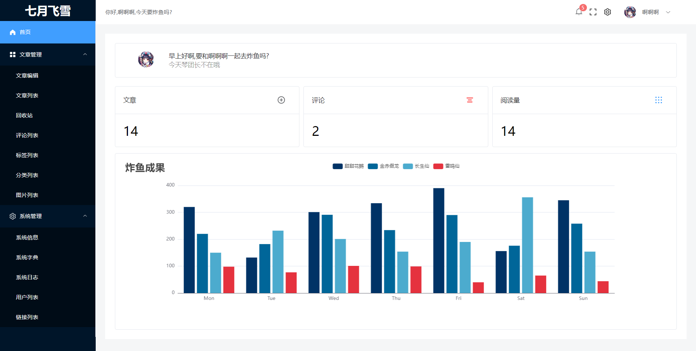
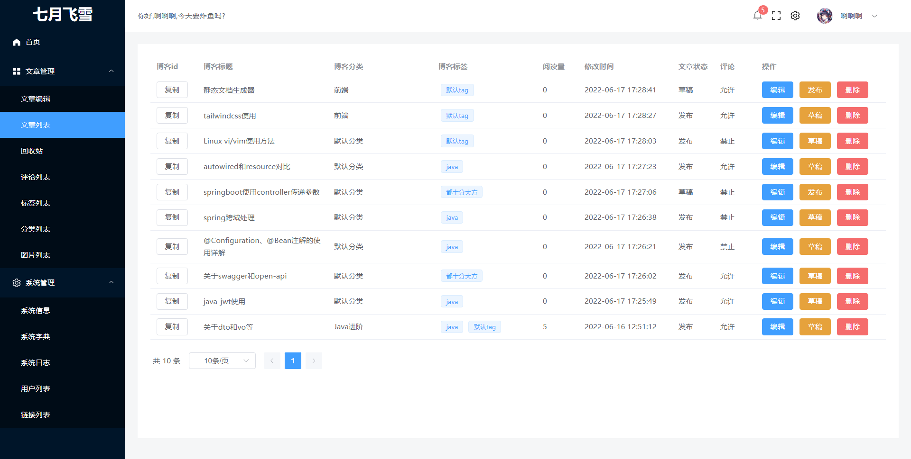
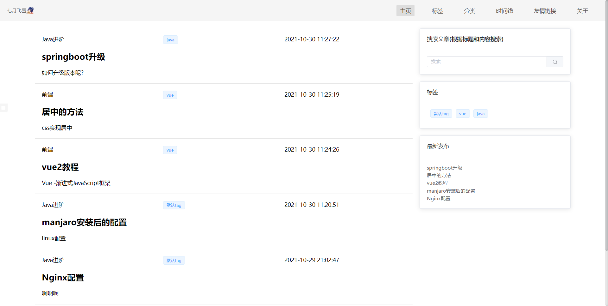
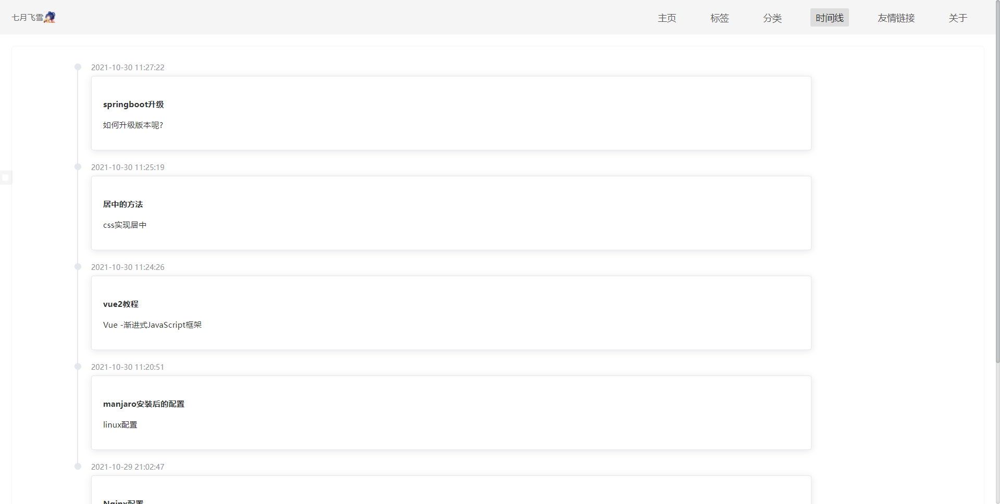

# mild-blog

> 一个简陋个人博客

## 技术

- 后端,springboot+mybatisplus+jwt| gin+gorm+golang-jwt

- 前端,vue3+vue-router+vuex+axios|quasar

## 运行

### 运行后端代码

进去myblog-server

```shell
mvn spring-boot:run
```

### 运行前端代码

分别进入myblog-web(后台界面),myblog-quasar(前台界面)
执行

```shell
yarn dev
```

注意vite引用的用法

引用图片

```html

```

## 演示图片

管理员界面





首页



时间线


